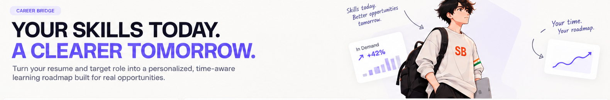
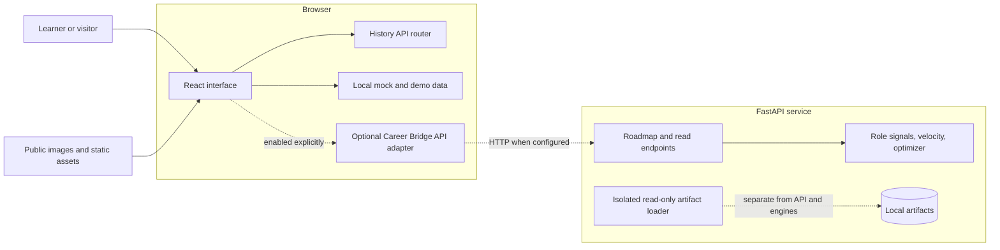
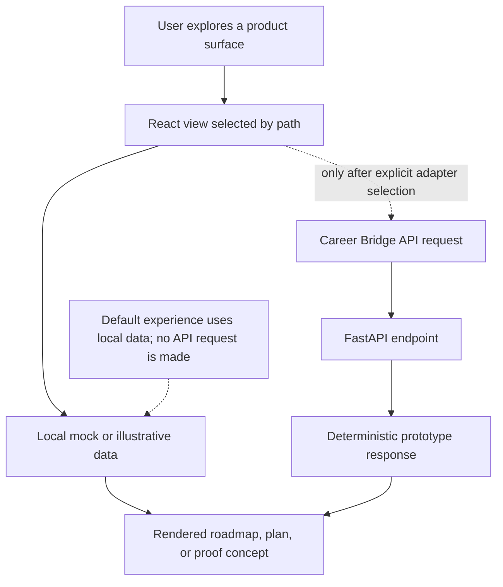
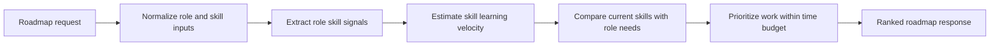
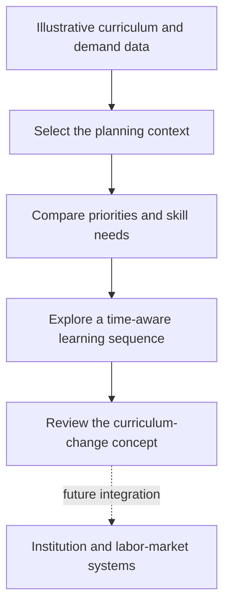
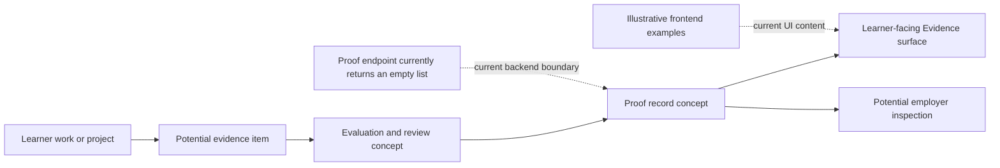
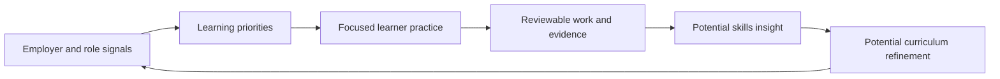

# SkillBridge

### Turn career goals into a focused path from skills to proof.

SkillBridge is an education-to-employment product prototype for connecting a
learner's current skills to a target role, a practical learning plan, and
evidence that can be evaluated. It brings learner planning, curriculum
adaptation, and proof concepts together in one experience.

> **Project status:** The frontend is a working, mock-first product demo. The
> FastAPI service is a separate backend prototype; the app does not call it by
> default. Demo content and illustrative benchmarks are not live labor-market
> data or independently verified outcomes.

## Product thesis

People often have to bridge the gap between what they can do and what a role
requires without a clear, credible next step. SkillBridge's thesis is that the
bridge should be explicit: identify relevant gaps, fit learning to a person's
available time, and make the resulting work easier to inspect.

The prototype explores four connected product surfaces:

| Surface | What it explores |
| --- | --- |
| **Career Bridge** | Compare a learner profile with a target role and shape a skill roadmap around a time budget. |
| **Curriculum Time Machine** | Explore how learning priorities and a curriculum plan might change as needs evolve. |
| **Evidence** | Organize proof and validation concepts around work products, evaluation, and review. |
| **Multiplier Effect** | Show the product thesis as a reinforcing relationship between learners, education, and employers. |

These are product concepts, not claims that the prototype has deployed a
network, verified credentials, or measured employment outcomes.

## Experience at a glance

<p align="center">
  
</p>
<p align="center"><em>Homepage reference image from the project.</em></p>

The repository also contains reference images for individual product surfaces:

| Career Bridge | Curriculum Time Machine | Evidence | Multiplier Effect |
| --- | --- | --- | --- |
|  |  |  |  |

## What makes the approach distinctive

- **A connected journey:** roadmap planning, curriculum adaptation, and proof
  are presented as related parts of career preparation.
- **Time-aware planning:** Career Bridge's backend prototype can allocate
  learning work against an available-hours budget.
- **Inspectable reasoning:** the backend separates role signals, skill
  velocity, and roadmap optimization into readable engine modules.
- **A proof-oriented product direction:** Evidence explores how a learner's
  work could be reviewed rather than treating course completion alone as proof.
- **An honest prototype boundary:** current UI data is labeled and treated as
  demo or illustrative content; no live outcome claims are made.

## Product surfaces

### Career Bridge

Career Bridge is the learner-facing roadmap concept. The experience is designed
around a learner profile, a target role, skill gaps, and an available learning
budget. Its local UI data is mock-first. The separate backend accepts a roadmap
request and runs a deterministic prototype pipeline; the default frontend
configuration does not submit requests to that service.

### Curriculum Time Machine

Curriculum Time Machine is an illustrative planning surface for exploring
curriculum and learning-priority changes over time. Its current content comes
from local demo data. It is not connected to a live institution information
system or a production scheduling service.

### Evidence

Evidence presents proof and validation concepts, including example evidence
types and evaluation views. The frontend content is illustrative. Backend
`/proofs` and `/vendor-flags` endpoints currently return empty lists; no
external credential provider or evaluator is connected.

### Multiplier Effect

Multiplier Effect visualizes the thesis that learner progress, educational
planning, and employer signals can reinforce one another. It is a product
concept, not an automated feedback network. The homepage's Multiplier Effect
navigation uses the existing full-screen route transition; Career Bridge
navigation is direct.

## Architecture



The frontend and backend are intentionally separate in the current setup. The
artifact loader is also isolated: it reads local artifact files and is not
currently consumed by the API routes or roadmap engines.

## Data flow



Career Bridge's source selection lives in
[`src/data/careerBridgeSource.js`](src/data/careerBridgeSource.js). It currently
selects `mock`. Switching to the API adapter is an explicit code/configuration
choice, not automatic service discovery.

## Career Bridge pipeline



This diagram describes the backend prototype's processing stages. It does not
imply that the live website currently sends a learner's information to the API.

## Curriculum Time Machine flow



The current interface uses local illustrative data. The final node is a
potential integration direction, not a current data source.

## Evidence and proof architecture



The diagram is a conceptual model. The current prototype does not establish
that work has been independently assessed or that a proof record is a
production credential.

## Multiplier Effect flywheel



The flywheel describes the product's intended reinforcing loop. Its
integrations and feedback cycles are not automated in this prototype.

## Key interactions

- Navigate among the homepage, Career Bridge, Curriculum Time Machine,
  Evidence, and Multiplier Effect.
- Explore product-specific roadmap, planning, and proof views using their
  current demo content.
- Follow homepage calls to action into Career Bridge with standard direct
  navigation.
- Use the full-screen transition for the Multiplier Effect route.
- Run the FastAPI roadmap endpoint independently for backend development and
  testing.

## Routes

| Path | Page | Data and behavior |
| --- | --- | --- |
| `/` | Homepage | Product introduction and navigation |
| `/career-bridge` | Career Bridge | Mock-first learner roadmap experience |
| `/curriculum-time-machine` | Curriculum Time Machine | Illustrative curriculum planning experience |
| `/evidence` | Evidence | Proof and validation concepts with illustrative data |
| `/multiplier-effect` | Multiplier Effect | Product thesis visualization and existing route transition |

Routing is implemented with the browser History API in
[`src/router.js`](src/router.js); there is no routing framework.

## Technology

| Area | Technology |
| --- | --- |
| Frontend | React 18, Vite 5, JavaScript, plain CSS |
| Navigation | Hand-rolled History API |
| Motion | GSAP and CSS |
| Backend | Python, FastAPI, Pydantic v2 |
| Backend tests | pytest |
| 3D dependency | Three.js is installed but is not imported by the live app |

## Repository structure

```text
.
├── backend/
│   ├── data/                 # Isolated local artifact readers and data
│   ├── engines/              # Roadmap signals, velocity, and optimization
│   ├── tests/                # Backend tests
│   ├── main.py               # FastAPI application and endpoints
│   └── schemas.py            # Request and response contracts
├── public/
│   ├── assets/               # Static product assets
│   └── references/           # Product reference images
├── src/
│   ├── components/           # Shared and product-surface components
│   ├── data/                 # Mock and illustrative UI data
│   ├── pages/                # Route-level page components
│   ├── App.jsx               # Route composition and page titles
│   ├── router.js             # History API navigation
│   └── styles.css            # Global styles and tokens
├── DESIGN.md                 # Visual design system
├── index.html
└── package.json
```

## Setup and running

### Frontend

Requirements: Node.js and npm.

```bash
npm install
npm run dev
```

Vite prints the local development URL. To create a production build:

```bash
npm run build
```

To serve the generated build locally:

```bash
npm run preview
```

### Backend

Requirements: Python 3.10 or newer.

```bash
python -m venv .venv
```

Activate the environment in PowerShell:

```powershell
.\.venv\Scripts\Activate.ps1
```

Then install the backend requirements and start the service from the repository
root:

```bash
python -m pip install -r backend/requirements.txt
python -m uvicorn backend.main:app --reload
```

The interactive API schema is available at `http://127.0.0.1:8000/docs`.
Available endpoints include:

| Method | Path | Current purpose |
| --- | --- | --- |
| `POST` | `/roadmap` | Generate a roadmap prototype response |
| `GET` | `/velocity/{skill}` | Return a skill-velocity estimate |
| `GET` | `/vendor-flags` | Vendor flags; currently an empty list |
| `GET` | `/proofs` | Proof records; currently an empty list |

The frontend source adapter includes a configurable API base URL, but the
default source is `mock`. To develop against the service, explicitly select
the API source in `src/data/careerBridgeSource.js` and set
`VITE_CAREER_BRIDGE_API` to the backend URL before starting Vite. The frontend
does not automatically switch to the API when the service is running.

### Tests

Run backend tests from the repository root:

```bash
python -m pytest backend/tests -q
```

There is no configured frontend test, lint, or type-check script.

## Current limitations

- Frontend data is local mock or illustrative data by default; it is not a
  production learner profile or live labor-market feed.
- The web app and FastAPI backend are not connected by default.
- Career Bridge processing is a deterministic prototype, not a validated
  career recommendation service.
- Curriculum Time Machine is not connected to institutional curriculum
  systems.
- Evidence examples and evaluation benchmarks are illustrative; no production
  verification provider or audited outcomes are represented.
- `/proofs` and `/vendor-flags` currently return empty lists.
- The artifact loader is isolated from the API and engine modules.
- Authentication, persistent learner accounts, and production deployment
  configuration are outside the current prototype.

## Roadmap

Potential next steps, subject to product and data validation:

1. Define privacy, consent, and data-retention requirements before accepting
   real learner records.
2. Connect the frontend to the backend behind explicit, tested contracts.
3. Validate role-skill mappings and time-budget recommendations with domain
   experts and representative data.
4. Design evidence review workflows and integrations with appropriate
   verification partners.
5. Explore institution and employer integrations only after access, governance,
   and evaluation criteria are established.
6. Add end-to-end and accessibility coverage as the interactive flows mature.

No outcome, adoption, accuracy, or employment metric is claimed by this
roadmap.

## Design and contribution notes

[`DESIGN.md`](DESIGN.md) is the source of truth for interface tokens,
responsive behavior, accessibility, and visual patterns. Keep changes within
the existing React/CSS architecture, preserve the separation between local UI
data and backend contracts, and run the relevant build or test command before
submitting changes.
